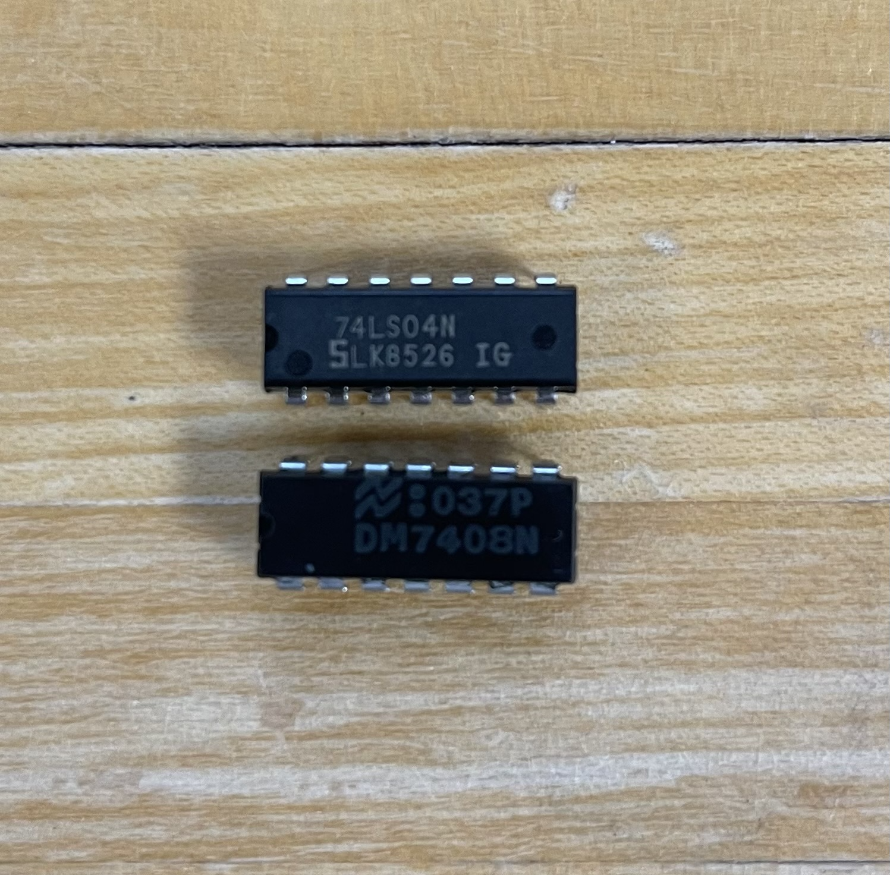
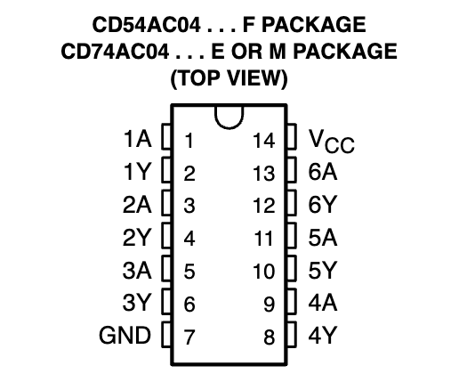
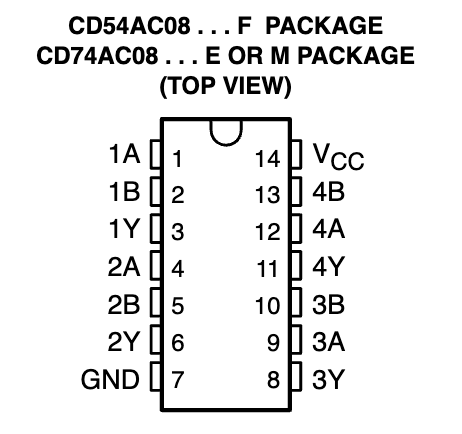
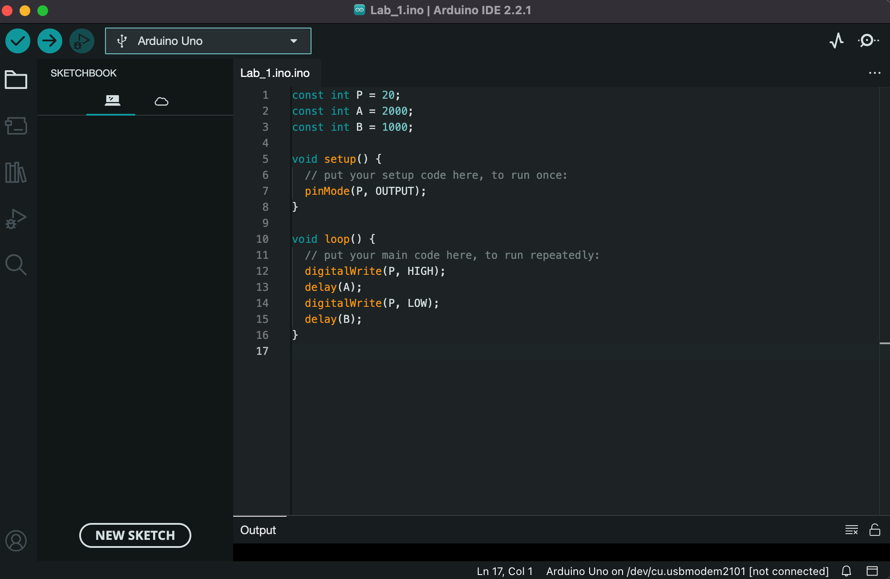

# Lab 01: Journey into Hardware - Exploring the Basics of Breadboarding and Arduino in the Lab!!

## Overview and Motivation
This lab introduces the hardware environment used in the course, focusing on the PB-503 breadboard prototyping stations and Arduino microcontroller systems. The activities involve exploring the breadboard's features and integrating the Arduino for embedded processor control. You will work with components like LEDs, resistors, and integrated circuit chips, requiring reference to IC data sheets. The lab aims to develop skills in reading data sheets, understanding the components' functions, and, last but not least, experiment with computer hardwares!

## Materials
- PB-503 breadboard prototyping station


- Arduino microcontroller kit (includes LEDs, Resistors, USB-A cable for Arduino connection)


- LEDs
- 330 Ohm Resistors
- Logic gates (7404 OR gate IC and 7408 AND gate IC)



- IC data sheets
- Wires and connection tools


- Logic Probe
- Arduino IDE software
- Laptop or device for programming and connecting to the Arduino

## Project Steps

### BREADBOARD BASICS

#### 1. Getting started with our PB-503 Breadboard:

- Our PB-503 Breadboard prototyping station is used to connect and test electrical circuits. It contains three breadboard units and several peripheral devices including **power supplies** (top right), **LED logic indicators** (under the power supplies), a **speaker** (under the logic indicators), **potentiometers** (under the breadboard), **logic switches** (next to the potentiometers), and a **function generator** (under the red on/off button).

#### 2. Powering up the Breadboard:

- We can start by plugging in the PB-503 and turn it on. 

- Referring to one of the three knobs on the top right (see image below), you can see our power supply. In this lab, we only need the red +5 Volts power supply as our circuits we use all run on 5 Volts. Also, underneath the main power supplies is the black Ground connection (0 Volts). 


- We can see that the +5 Volts power supply and the Ground connection are connected to the top and fourth row of the first breadboard respectively. As a result, all the pins in the first row carry the +5 Voltage while those in the fourth row carry 0 Voltage. Likewise, the brown and purple wires connecting the top rows to the remaning breadboard pins underneath transfer the +5 Voltage and the Ground Voltage respectively. 

#### 3. Utilizing Logic Indicators:


- The set of onboard Logic Indicators is used to determine **HIGH** OR **LOW** voltage from a location on the breadboard by connecting a wire from the location of interest to one of the eight Logic Indicators. The trick is keeping one end of the wire connected to a logic indicator and the other can be plugged in to any location on the breadboard that needed testings. 

- If the wire is plugged in to a **+5 Volts pin**, the corresponding LED logic indicator turns **red**.

- If the wire is plugged in to a **Ground pin**, the corresponding LED logic indicator turns **green**.

- If the wire is plugged in to a pin that is **not connected to either pins**, the corresponding LED logic indicator **will not light up**.

#### 4. Finding the pattern:

- Given the breadboard has brown and purple wires connecting the top rows to the remaning breadboard pins underneath transfer the +5 Voltage and the Ground Voltage respectively. We can use the logic indicators to continue tracking down where +5 Volts and Ground are available throughout the board.


- Using logic indicators to test the pins of the columns that are either connected to the +5 Volts or Ground via the brown and purple wires, we can notice the pattern that is the repeating of the cycle **High - Low - Low - High** as it follows the pattern horizontally: **Low - High | High - Low - Low - High | High - Low - Low - High | High - Low**.

- Also, we can see that the pins that has electricity running through them share the same voltage with those in the same **COLUMN**. While the pins in the columns in between do not carry any voltage.

- On the other hand, when giving the pins in between electricity by connecting one with a pin of +5 Volts, all the pins in the same **ROW** will carry the same voltage.

### CAUTION: always turn off the breadboard power while doing the wiring

### BUILDING OUR FIRST DIGITAL CIRCUIT (DEMO 1)

- Think of a circuit as a complete pathway for electricity to travel, like a road from a higher point (+5V) to a lower point (Ground), with various electronic elements in between. 

- Now, let's create a basic circuit that will make an LED light up – we'll eventually make two of them! We are using one LED and one 330 Ohm resistor from the Arduino kit (or any other resistor value). 

- Here's the trick with LEDs: they have a specific direction, like an arrow. Connect the longer side of the LED to the higher voltage (+5V) and the shorter side to the lower voltage (GND). It's crucial to get this right because electricity only flows one way through an LED.

- Eventually, we want to see our LED light up like below:


- In the picture, we can see that +5 Voltage electricity goes through the yellow wire to a pin of the same row as the long side of the LED while the resistor supplies low voltage electricity (Ground) to a pin of the same row as the short side of the LED. As a result, the light turns on!

### BLINKING LEDs WITH FUNCTION GENERATOR (DEMO 2)

- In this demo we will substitute the function generator for the +5 Volts input to our previous LED circuit as we disconnect the yellow wire, and connect that pin to one of the six non-TTL pins below the function generator. (**Blue wire**)

- Function generator's default settings: 

    + Bottom switch to a square wave

    + Set the frequency to 1.0 and the unit should be Hz

    + Set the AMP slider to its top setting

- When we turn on the breadboard, the LED should be blinking on and off.


### 7404 LOGIC GATE IC (NOT GATE) (DEMO 3)

#### 1. Understanding the inverter: 



- Above is the top view of the 7404 inverter (our logic NOT gate) with six individual inverters, each with an input and an output. 

- The **A** pins are the **inputs** for their corresponding inverter. For example, 1A is the input for inverter 1 and 2A is the input for inverter 2. 

- The **Y** pins are the **outputs** for their corresponding inverter.

- The pin in the top right corner must be connected to Vcc, which is another words for a source of +5 Voltage electricity.

- The **GND** pin in the bottom left corner must be connected to a ground voltage electricity.
 
#### 2. Building the circuit:

- As mentioned above, the 7404 inverter needs an input (should be +5 Voltage power source), a +5 Volts electricity to Vcc and a Ground connection.

- We can break down the wiring system for this circuit (see picture below) as follow:

    + **Yellow wire**: connects the Vcc pin of the inverter to a +5 Volts electricity source.

    + **Brown wire**: connects the GND pin of the inverter to a Ground connection on the board.

    + **Red wire**: connects the **1A input source** to a logic indicator LED light to detect/check if there is any electricity coming in our 1A input. 

    + **Blue wire 1**: supplies the **1A input source** of the inverter with +5 Volts electricity from the function generator.

    + **Blue wire 2**: connects the **1Y output** to a logic indicator LED light to determine the voltage of the output.


### 7408 LOGIC GATE IC (AND GATE) (DEMO 4)

#### 1. Understanding the inverter:



- Above is the top view of the 7408 inverter (our logic AND gate) with four independent AND gates, each with two inputs and one output. 

- The **A** pins are the **first inputs** for their corresponding AND gate. For example, 1A is the input for AND gate 1 and 2A is the input for AND gate 2. 

- The **B** pins are the **second inputs** for their corresponding AND gate.

- The **Y** pins are the **outputs** for their corresponding AND gate.

- The pin in the top right corner must be connected to Vcc, which is another words for a source of +5 Voltage electricity.

- The **GND** pin in the bottom left corner must be connected to a ground voltage electricity.

#### 2. Building the circuit: 

- As mentioned above, the 7408 inverter needs two inputs (should be +5 Voltage power source), a +5 Volts electricity to Vcc and a Ground connection.

- We can break down the wiring system for this circuit (see picture below) as follow:

    + **Yellow wire**: connects the Vcc pin of the inverter to a +5 Volts electricity source.

    + **Short brown wire**: connects the GND pin of the inverter to a Ground connection on the board.

    + **2 Blue wires connecting with 1A input**: the left wire connects it to **logic switch S1** while the right wire goes to one of the logic indicator LED lights for electricity detection.

    + **3rd Blue wire and Red wire**: this blue wire underneath the previous two goes to one of the  the logic indicator LED lights for electricity detection while the red wire connects the **1B** input to **logic switch s1**.

    + **Long brown wire**: connects the output 1Y of the inverter to one of the logic indicator LED lights to determine the voltage of the output.


- Different S1 and S2 switch values will output different set of inputs and outputs. (Refer to testing section)


### ARDUINO CONTROL (DEMO 5)

Here is a closer look at our Arduino: 


#### 1. Understanding the Arduino control:

- Imagine the Arduino as a tiny but capable brain that we can program to make our circuits do things automatically, without the need for constant modifications. It's like giving our project a set of instructions and the Arduino follows them on its own. 

- In this final part of the lab, we will figure out how to make the circuit that we set up on the breadboard operate independently using an Arduino, a USB cable and our laptop with Arduino IDE installed for programming the Arduino. 

#### 2. Programming the Arduino:

- First, we need to have the Arduino IDE (like a code editor but has more features) installed on the personal laptop from this link: https://www.arduino.cc/en/software

- Plug the USB cable from the laptop to the socket on the Arduino. 

- We will lauch our downloaded Arduino IDE to program the Arduino with our set of codes

- Inside the Arduino IDE, we can click the file icon on the top left underneath the tick button and create a new **sketch** and save it as **Lab 1**.

- Type the following code into the Lab 1 sketch we just created: 

```C++
const int P = 13;
const int A = 1000;
const int B = 1000;

void setup() {
  // put your setup code here, to run once:
  pinMode(P, OUTPUT);
}

void loop() {
  // put your main code here, to run repeatedly:
  digitalWrite(P, HIGH);
  delay(A);
  digitalWrite(P, LOW);
  delay(B);
}
```
- Lets dive into the block of code we just used. Firstly, the constant variables `P` represents the pin number or, in other words, a specific pin on the Arduino board that can be used to send or receive electrical signals as the Arduino board has a set of pins that are either input, output, analog input, power supply, ground. The other `A` and `B` constants represents the duration of two delays in miliseconds.

- Once the Arduino is powered, the `setup()` function is called. Inside it, the function `pinMode(P, OUTPUT)` configures pin number 13 on the Arduino board as an output, indicating that it will be used to send signals of either High or Low voltage. 

- the `loop()` function acts as a loop that keeps running after the `setup()` function. Inside it, the function `digitalWrite(P, HIGH)` sets the pin number 13 on the Arduino board to high voltage (+5 Volts). `delay(A)` pauses the loop for some miliseconds depending on the value of `A` (1000 miliseconds in this case). After the delay, the function `digitalWrite(P, LOW)` is called again to set the pin number 13 to low voltage (Ground), and each iteration ends with a delay of `B` miliseconds.

- Note that every Arduino program (also called "sketch") must define the two function `setup()` and `loop()` to run properly.
 
- Having understood the code, we have to make sure that our IDE recognizes the Arduino board being used by checking the drop down menu on the top of the IDE.

- Now we will hit the **verify** button (the checked mark on the top left of the IDE window) to compile the code and check that it is correct in terms of syntax. If there's an error, we have to fix the code and verify it again. Otherwise, we can proceed by clicking the **upload** button to the IDE to load our program to the Arduino. The red light on the Arduino will blink rapidly as it receives the set of instructions (the code) from our laptop. 

#### 3. Integrating the Arduino to our circuit:

- Firstly, we have to make sure the Arduino is powered up. In this case, the laptop will be the power supplier since it is connected via the USB cable. Also, it is necessary to have the Arduino GND (Ground) connected to a pin that carries Ground Voltage on the breadboard (**Red Wire**). Notice we have several GND pins on the Arduino, we can just connect one of them to the breadboard's GND pin. 

- We can start the wiring process by wiring pin 13 on the Arduino (notice that is the value of the `P` constant in the code) to the first input pin on the AND gate (**Blue Wire**), substituting the logic switch S1. The second AND input should remain connected with the logic switch S2 (**Purple Wire**).

- Make sure the logic switch S2 is switched to high. We can see the outcome below:


- The circuit behaved just like what we could expect when looking at the code. The two `digitalWrite()` functions in the loop makes the input to repeatedly change from high to low voltage as seen in the first LED logic indicator light. As a result, the output changes accordingly.

## Testing

### BLINKING LED WITH FUNCTION GENERATOR (DEMO 2)

- We have previously seen the LED light blinking at a fairly constant rate with the default settings like below:


-  As we moved the amplitude range switch from 1 to 10, we noticed that the light started to flash even faster. We we set the switch to 100, the light flashes so fast that it looks as if it is not flashing. Also as we adjusted the AMP slider we noticed that the brightness of the light was affected. The higher the slider was, the brighter the LED was, and the lower the slider was the dimmer the LED was.


### 7404 LOGIC GATE IC (NOT GATE) (DEMO 3)

- This circuit resulted in the logic probe lights flashing alternatively. As you can see in the video down below the logic probe lights are alternating postions left and right, for both the high and the low ends. It is important to point out that whatever voltage the input is, the output's voltage will always be the opposite.

- To ensure that the circuit worked properly we had to make sure the the logic probe switch was set to +5 and not V-. 


### 7408 LOGIC GATE IC (AND GATE) (DEMO 4)

-  This circuit has a variety of outcomes depending on the logic switches **S1** and **S2** that act as the power supplies for the two inputs **1A** and **1B**. See the gif below to see all the outcomes:


- From the footage above, we can see that the only time the output is high voltage was when both the inputs are of high voltage. The remaining sets of inputs all results in a low voltage output. Here are the sets of outcomes:

| Switch combo (S1, S2)  |      1A       |       1B      | 1Y (Output) |
| :---------------------:|:-------------:|:-------------:| -----------:|
| down, down             | low voltage   | low voltage   | low voltage |
| down, up               | low voltage   | high voltage  | low voltage |
| up, up                 | high voltage  | high voltage  | high voltage|
| up, down               | high voltage  | low voltage   | low voltage |

#### ARDUINO CONTROL (DEMO 5)

##### 1. Changing the logic switch:

- In the fifth demo we have already seen how the LED logic indicator lights behaved when the logic switch S2 is on. Now we are going to see how the circuit behaves when we switch off the S2 logic switch: 


- As you can see, when we turn off the logic switch S2, the LED light of the input 1B of the inverter indicates low voltage while the light of the input 1A that connects to pin 13 of the Arduino stays the same. However, the biggest difference is that the output now stays constant of low voltage instead of changing like when the switch S2 is on. 

##### 2. Changing the Arduino's variable values: 



- For the last testing cases, we are changing the value of the variables in the Arduino's code, particularly `P` and `A`. This means that the pin position on the Arduino board is now slot 20 instead of 13. Below are two different circuit behaviors with the logic switch S2 off and on.


- The most noticeable thing we observed was that the LED lights in the logic indicator stopped changing, indicating that there are no change in electricity voltage going into both inputs of the AND gate. This behavior might be explained as the input 1A of the AND gate is connected to the pin 13 of the Arduino board, but our pin location in the code is now 20, which might cause the 13 pin to supply low-voltage electricity. 

## Conclusion

In this lab, participants delve deeper into computer systems by engaging in practical exercises with the PB-503 breadboard and Arduino microcontroller. A breadboard is a tool used for constructing and testing electronic circuits. It's a rectangular board with a grid of holes where components like resistors, capacitors, and wires can be inserted to form connections. This makes it ideal for experimenting and prototyping circuits. A microcontroller is like a mini-computer on a single chip, designed to control specific functions in machines or devices. It's small but has its own processor, memory, and parts to connect to other devices, making it perfect for tasks in everyday gadgets like washing machines, remote controls, or small robots. It contains a processor, memory, and input/output peripherals on a single chip. In the context of this lab, the Arduino, a popular microcontroller, is used for programming and controlling the electronic components assembled on the breadboard. Together, they form a powerful duo for applying the principles of electronic design and computer systems. During the lab, participants learned how to construct basic circuits and control them using the Arduino, which solidifies their understanding of circuit components and data sheet interpretation. These basic circuits included an LED circuit for understanding current flow and the directional nature of LEDs, and a setup using a function generator to manipulate LED behavior. This setup involved using the function generator to create different electrical waveforms, which then controlled how the LED operated, like changing its brightness or making it blink. Additionally, a logic gate-based circuit was also included. This hands-on approach is crucial for grasping the fundamentals of computer hardware and electronic design. Exploring these concepts is essential for developing skills in hardware system design and programming, laying the groundwork for advanced studies in computer engineering and electronics. This lab not only teaches technical skills but also emphasizes the significance of experimental learning in complex computer systems.